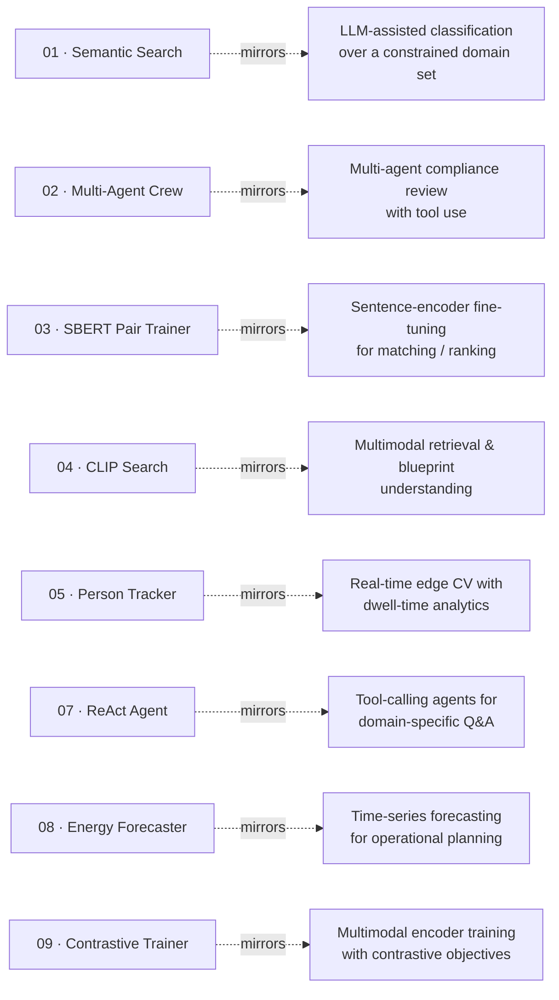

<!--
  ai-related-work  —  Profile-grade README
  Author: Deepak Chaudhary  ·  github.com/deepak1212194
-->

<h1 align="center">Hi, I'm Deepak 👋</h1>

  

  

  
  
  
  
  
  
  
  

---

I build **production AI systems end-to-end** — from data pipelines and model fine-tuning to autoscaling cloud and edge deployments. My work spans **LLMs, RAG, recommendation, semantic search, and computer vision**.

- 🧠 Multi-agent system **demonstrated live at NVIDIA GTC 2026**
- 🛰️ Co-inventor on a **granted Indian patent** for UAV-based disaster management
- 🎓 M.Tech, Computer Science — **Indian Statistical Institute (ISI), Kolkata**
- 📍 Hyderabad, India

This repo is a curated set of focused, runnable demos written from scratch, mirroring the kinds of systems I design at work.

---

## 📁 Projects

Every project is a **runnable service** — FastAPI backend, built-in browser UI, Docker-ready. Clone, `cd` in, `docker compose up`, open the URL.

| # | Project | What it shows | Stack |
|---|---|---|---|
| **01** | [**Semantic Search & Classification**](./01-rag-faq-bot/) | Embedding retrieval + **weighted-vote domain classification** with eval metrics | FastAPI · FAISS · SBERT · Pydantic · Docker |
| **02** | [**Multi-Agent Research API**](./02-multi-agent-research-crew/) | 4-agent crew with **live SSE streaming** dashboard | FastAPI · SSE · OpenAI · Docker |
| **03** | [**SBERT Training Pipeline**](./03-sbert-pair-trainer/) | 4-stage fine-tuning pipeline + **metrics dashboard** + filesystem registry | YAML configs · Pydantic · Docker |
| **04** | [**CLIP Visual Search**](./04-clip-image-text-search/) | Multimodal retrieval with **drag-drop UI** + similarity scores | FastAPI · CLIP · Docker |
| **05** | [**Edge Person Tracker + Dwell Analytics**](./05-person-tracker-mini/) | YOLO + IoU tracker with **dwell-time monitoring**, zone occupancy, heatmap over **WebSocket** | FastAPI · WebSocket · YOLOv8 · OpenCV · Docker |
| **06** | [**Resume Enhancer — Skill-Driven Agent**](./06-resume-enhancer-app/) | AI agent with **editable skill files** (skills/*.md), **ATS scoring**, hot-reload | FastAPI · Skill Files · ATS · PyMuPDF · HF/Claude · Docker |
| **07** | [**ReAct Weather Agent**](./07-react-weather-agent/) | Pure **ReAct loop** with tool calling, SSE trace streaming, offline mode | FastAPI · OpenAI · SSE · Pydantic |
| **08** | [**Energy Forecaster**](./08-energy-forecaster/) | **SARIMA vs XGBoost** 24h-ahead demand forecasting with anomaly detection | FastAPI · XGBoost · statsmodels · pandas |
| **09** | [**Multimodal Contrastive Trainer**](./09-multimodal-contrastive-trainer/) | **ResNet-50 + BERT** dual encoder with InfoNCE & focal loss, Recall@K eval | FastAPI · PyTorch · torchvision · HF |

> Architecture is consistent across projects: typed Pydantic schemas, env-driven config, singleton models warmed at startup, healthchecks, and a single-file UI per service.

---

## 🛠️ Tech I use

  
  
  
  
  
  
  
  
  
  
  
  
  

**Day-to-day:** PyTorch · Hugging Face · SentenceTransformers · LangChain · CrewAI · FAISS · Azure ML / OpenAI · AKS · Docker · NVIDIA NIM / DGX Spark · YOLO · DeepStream · XGBoost

---

## 🏗️ How these demos map to my real work

The repo shows **simplified, public versions** of patterns I've shipped in production:

| Demo here | Pattern in production |
|---|---|
| Semantic Search & Classification | LLM-assisted classification over a constrained domain set |
| Multi-Agent Research Crew | Multi-agent compliance review with tool use |
| SBERT Pair Trainer | Sentence-encoder fine-tuning for matching / ranking |
| CLIP Image-Text Search | Multimodal retrieval & document understanding |
| Person Tracker + Dwell Analytics | Real-time edge CV on RTSP camera streams with IoT alerting |
| ReAct Weather Agent | Tool-calling agents for domain-specific Q&A |
| Energy Forecaster | Time-series forecasting with model comparison |
| Multimodal Contrastive Trainer | Multimodal encoder training with contrastive objectives |

---

## 📈 Stats

  <picture>
    <source media="(prefers-color-scheme: dark)" srcset="https://github-readme-stats.vercel.app/api?username=deepak1212194&show_icons=true&theme=tokyonight&hide_border=true&include_all_commits=true&count_private=true" />
    <source media="(prefers-color-scheme: light)" srcset="https://github-readme-stats.vercel.app/api?username=deepak1212194&show_icons=true&theme=default&hide_border=true&include_all_commits=true&count_private=true" />
    
  </picture>
  <picture>
    <source media="(prefers-color-scheme: dark)" srcset="https://github-readme-stats.vercel.app/api/top-langs/?username=deepak1212194&layout=compact&theme=tokyonight&hide_border=true&langs_count=8" />
    <source media="(prefers-color-scheme: light)" srcset="https://github-readme-stats.vercel.app/api/top-langs/?username=deepak1212194&layout=compact&theme=default&hide_border=true&langs_count=8" />
    
  </picture>

  <picture>
    <source media="(prefers-color-scheme: dark)" srcset="https://github-readme-streak-stats.herokuapp.com?user=deepak1212194&theme=tokyonight&hide_border=true" />
    <source media="(prefers-color-scheme: light)" srcset="https://github-readme-streak-stats.herokuapp.com?user=deepak1212194&theme=default&hide_border=true" />
    
  </picture>

---

## 🐍 Contribution graph (animated)

  <picture>
    <source media="(prefers-color-scheme: dark)" srcset="https://raw.githubusercontent.com/deepak1212194/ai-related-work/output/snake-dark.svg" />
    <source media="(prefers-color-scheme: light)" srcset="https://raw.githubusercontent.com/deepak1212194/ai-related-work/output/snake.svg" />
    
  </picture>

> The snake animation is regenerated daily by a GitHub Action ([snake.yml](./.github/workflows/snake.yml)) and lives on the [`output`](https://github.com/deepak1212194/ai-related-work/tree/output) branch. The image link will go live a few minutes after the first workflow run.

---

## 📜 License

MIT — see [LICENSE](./LICENSE). Feel free to learn from, fork, and adapt.

Built and maintained by <a href="https://www.linkedin.com/in/deepak-chaudhary-285810b7">Deepak Chaudhary</a> · 2026

