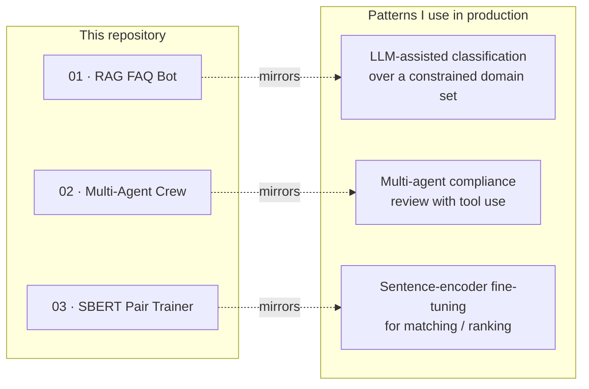

<!--
  ai-engineering-portfolio  —  Profile README
  Author: Deepak Chaudhary
-->

<h1 align="center">
  AI Engineering Portfolio
</h1>

<p align="center">
  
</p>

<p align="center">
  <a href="https://www.linkedin.com/in/deepak-chaudhary-285810b7"></a>
  <a href="mailto:deepak1212194@gmail.com"></a>
  
  
  
  
</p>

---

## Hi, I'm Deepak 👋

I build production AI systems end-to-end — from data pipelines and model fine-tuning to autoscaling cloud and edge deployments. My recent work spans **LLMs, RAG, recommendation, semantic search, and computer vision**, shipping at scale on Azure, GPU clusters, and edge devices.

- 🧠 Multi-agent system **selected for live demonstration at NVIDIA GTC 2026**
- 🛰️ Co-inventor on a **granted Indian patent** for UAV-based disaster management
- 🎓 M.Tech, Computer Science — **Indian Statistical Institute (ISI), Kolkata**
- 🇮🇳 Based in Hyderabad, India

This repository is a curated set of focused, runnable demos — written from scratch — that mirror the kinds of systems I design at work.

---

## 📁 Projects in this repository

| # | Project | What it demonstrates | Stack |
|---|---|---|---|
| **01** | [**RAG FAQ Bot**](./01-rag-faq-bot/) | Retrieval-Augmented Generation with **hallucination guard** via constrained-context prompting | `sentence-transformers` · `FAISS` · `OpenAI` · `Pydantic` |
| **02** | [**Multi-Agent Research Crew**](./02-multi-agent-research-crew/) | Sequentially-coordinated **multi-agent** system (planner → researcher → critic → writer) with tool use | `CrewAI` · `LangChain` · `OpenAI` |
| **03** | [**SBERT Pair Trainer**](./03-sbert-pair-trainer/) | Full **fine-tuning** of a sentence encoder with `CosineSimilarityLoss` + held-out evaluation (R² / MAE / RMSE) | `sentence-transformers` · `PyTorch` · `STS-B` |

> Each project is self-contained: clone the repo, `cd` into a project, install requirements, and run `python -m src.main` (or the project-specific entry point).

---

## 🛠️ Tech I use day-to-day

<p>
  
  
  
  
  
  
  
  
  
  
  
  
  
  
</p>

```
LLMs & GenAI       :   GPT-4 / GPT-4o, Llama, Qwen, RAG, Multi-Agent (CrewAI),
                       Prompt Engineering, Hallucination Mitigation
ML & Deep Learning :   PyTorch, Hugging Face Transformers, SentenceTransformers,
                       Fine-tuning, Model Evaluation (R² / MAE / held-out testing)
Vector & Retrieval :   FAISS, Azure AI Search, Embeddings, ANN, Cosine Similarity
Computer Vision    :   YOLOv5/v7/v8, U-Net, EfficientNet, OC-SORT, NVIDIA DeepStream
Cloud & MLOps      :   Azure ML, AKS, Azure DevOps CI/CD, Managed Endpoints, Docker
GPU & Edge         :   NVIDIA NIM, DGX Spark, Jetson Nano, T4 / V100, FP8 inference
```

---

## 🏗️ How the projects map to real systems I've shipped



---

## 📈 Stats

<p align="center">
  
  
</p>

> 🛈  After you create the repo, replace `YOUR_GITHUB_USERNAME` (3 places in this README) with your real handle and the cards will render automatically.

---

## 📜 License

Released under the [MIT License](./LICENSE) — feel free to learn from, fork, and adapt.

<p align="center"><sub>Built and maintained by <a href="https://www.linkedin.com/in/deepak-chaudhary-285810b7">Deepak Chaudhary</a> · 2026</sub></p>
